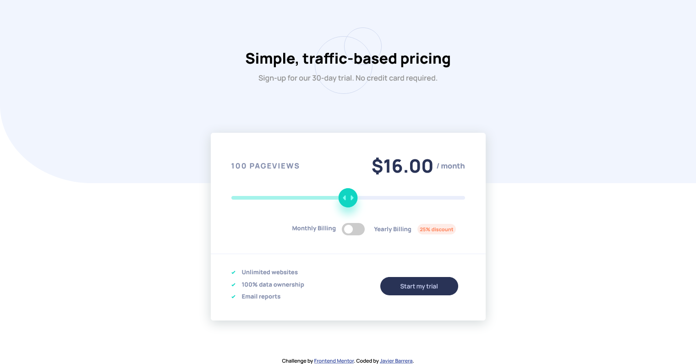

# Frontend Mentor - Interactive pricing component solution

This is a solution to the [Interactive pricing component challenge on Frontend Mentor](https://www.frontendmentor.io/challenges/interactive-pricing-component-t0m8PIyY8). Frontend Mentor challenges help you improve your coding skills by building realistic projects. 

## Table of contents

- [Overview](#overview)
  - [The challenge](#the-challenge)
  - [Screenshot](#screenshot)
  - [Links](#links)
- [My process](#my-process)
  - [Built with](#built-with)
  - [Continued development](#continued-development)
  - [Useful resources](#useful-resources)
- [Author](#author)

## Overview

### The challenge

Users should be able to:

- View the optimal layout for the app depending on their device's screen size
- See hover states for all interactive elements on the page
- Use the slider and toggle to see prices for different page view numbers

### Screenshot

### Links

- Solution URL: [https://github.com/javierb256/Interactive-pricing-component)
- Live Site URL: [https://interactive-pricing-component-iota-five.vercel.app/)

## My process

### Built with

- Semantic HTML5 markup
- CSS custom properties
- Flexbox
- Javascript

### Continued development

Use this section to outline areas that you want to continue focusing on in future projects. These could be concepts you're still not completely comfortable with or techniques you found useful that you want to refine and perfect.

#### Input Slider styling
I would like to continue working on styling different components that I have not had much experience working with such as the input slider. It was great to work on something new and I want to continue working on the slider and 
other different components in future projects.

#### Sass
I have started using Sass more in my projects and as I am still a beginner working on it, I want to continue working on my understanding on it so I can be more efficient with it and be able to improve the quality of my work.

### Useful resources

- [Styling range input with CSS](https://nikitahl.com/style-range-input-css) - This article greatly helped with with styling the range input component. The author gave a great breakdown on what each property does and how
to apply different stylings to different parts of the slider.
- [Styling Cross-Browser Compatible Range Inputs with CSS]https://css-tricks.com/styling-cross-browser-compatible-range-inputs-css/) - Another article on styling range inputs to be used on different browsers.

## Author

- Website - [Javier Barrera](https://github.com/javierb256)

